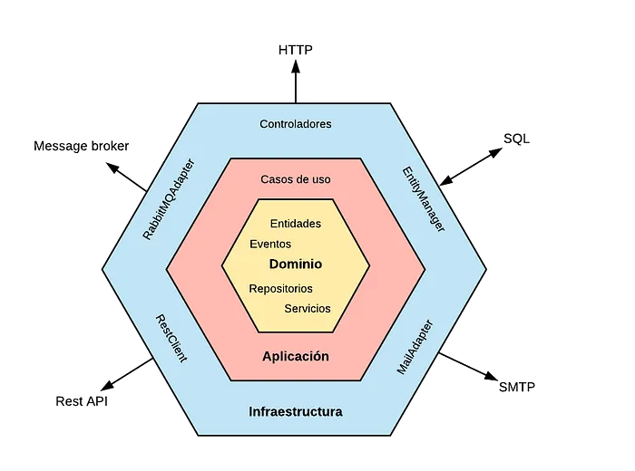
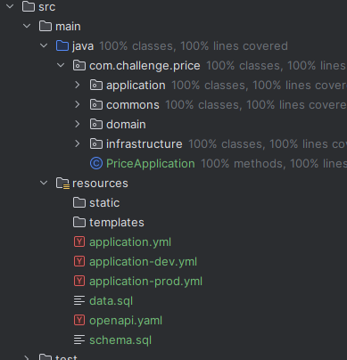
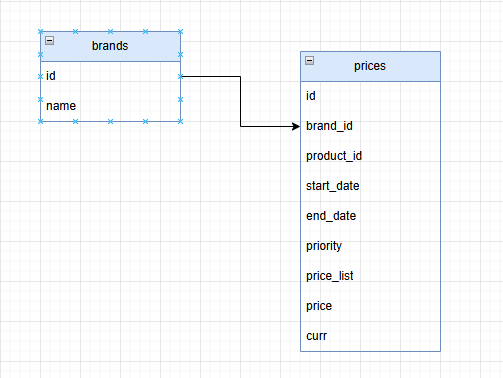
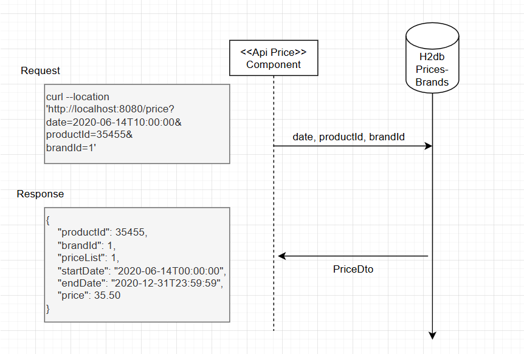
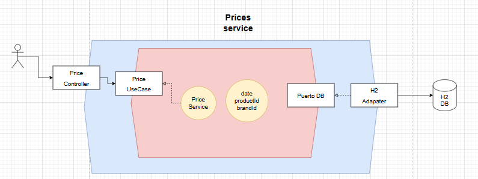

# Challenge Price API
Comercio electrónico de precios

---

## Tecnologías Utilizadas

- **Spring Boot**
- **Arquitectura Hexagonal (Ports & Adapters)**
- **H2**

---

## Repositorio y Documentación

- **Repositorio GitHub**: [challenge-price](https://github.com/JonathanJulio03/challenge-price)
- **Swagger UI (Documentación de API)**: [https://challenge-test.online/swagger-ui/index.html](https://challenge-test.online/swagger-ui/index.html)

---

## Tabla de Contenido

- [Instrucciones](#️instrucciones)
    - [Despliegue Local](#despliegue-local)
    - [Despliegue con Docker](#despliegue-en-docker)
- [Arquitectura y Diagramas](#arquitectura-y-diagramas)
    - [Arquitectura Hexagonal](#arquitectura-hexagonal)
- [CI/CD](#cicd)
  - [GitHub Actions](#github-actions)

---

## Instrucciones

### Despliegue Local

1. Configura el archivo `application.yml` y las variables de entorno desde `.env`.
2. Ejecuta los siguientes comandos:
```cmd
mvn clean install
mvn spring-boot:run
```

### Despliegue en Docker
```cmd
docker-compose up --build -d .
```
---
## Arquitectura y Diagramas

### Arquitectura hexagonal
La Arquitectura Hexagonal propone que nuestro dominio sea el núcleo de las capas y que este no se acople a nada externo. En lugar de hacer uso explícito y mediante el principio de inversión de dependencias nos acoplamos a contratos (interfaces o puertos) y no a implementaciones concretas.





### Diagramas

Diagrama DB



Diagrama de Flujo



Diagrama de Arquitectura



## CI/CD
### GitHub Actions
El CI/CD realiza las siguientes acciones:
**Install**
- sudo apt update && sudo apt upgrade -y
- sudo apt install openjdk-23-jdk  -y
- git clone https://github.com/JonathanJulio03/challenge-price.git challenge
- sudo apt install certbot python3-certbot-nginx
- sudo certbot --nginx
- sudo apt update && sudo apt install docker.io docker-compose -y
- chmod +x mvnw
- docker-compose up --build -d

**Logs**
- docker logs -f spring-app

**Config redirect**
- sudo nano /etc/nginx/sites-available/default
- sudo systemctl restart nginx