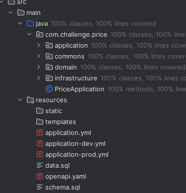

# Challenge Price API
Comercio electrónico de precios

---

## Tecnologías Utilizadas

- **Spring Boot**
- **Arquitectura Hexagonal (Ports & Adapters)**
- **H2**

---

## Repositorio y Documentación

- **Repositorio GitHub**: [challenge-price](https://github.com/JonathanJulio03/challenge-price)
- **Swagger UI (Documentación de API)**: [http://localhost:8080/swagger-ui/index.html](http://localhost:8080/swagger-ui/index.html)

---

## Tabla de Contenido

- [Instrucciones](#️instrucciones)
    - [Despliegue Local](#despliegue-local)
    - [Despliegue con Docker](#despliegue-en-docker)
- [Arquitectura y Diagramas](#arquitectura-y-diagramas)
    - [Arquitectura Hexagonal](#arquitectura-hexagonal)

---

## Instrucciones

### Despliegue Local

1. Configura el archivo `application.yml` y las variables de entorno desde `.env`.
2. Ejecuta los siguientes comandos:
```cmd
mvn clean install
mvn spring-boot:run
```

### Despliegue en Docker
```cmd
docker-compose up --build -d .
```
---
## Arquitectura y Diagramas

### Arquitectura hexagonal
La Arquitectura Hexagonal propone que nuestro dominio sea el núcleo de las capas y que este no se acople a nada externo. En lugar de hacer uso explícito y mediante el principio de inversión de dependencias nos acoplamos a contratos (interfaces o puertos) y no a implementaciones concretas.




### Diagramas

Diagrama DB


Diagrama de Flujo


Diagrama de Arquitectura

